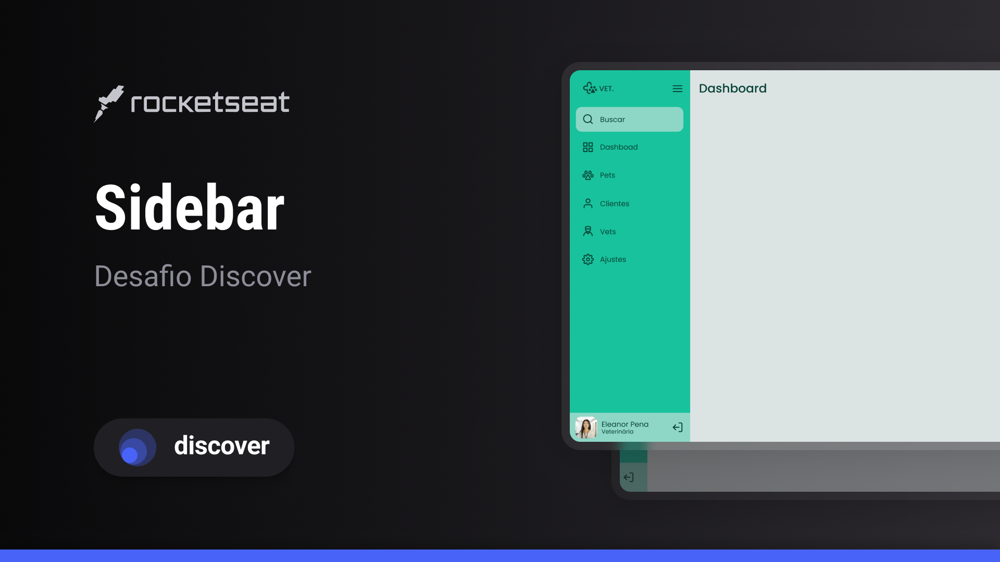

<h1 align="center"> Sidebar </h1>

  <a href="#-tecnologias">Tecnologias</a>&nbsp;&nbsp;&nbsp;|&nbsp;&nbsp;&nbsp;
  <a href="#-projeto">Projeto</a>&nbsp;&nbsp;&nbsp;|&nbsp;&nbsp;&nbsp;
  <a href="#-layout">Layout</a>&nbsp;&nbsp;&nbsp;

 

  

## 🚀 Tecnologias

Esse projeto foi desenvolvido com as seguintes tecnologias:

- HTML e CSS
- JavaScript
- Git e Github
- Figma

## 💻 Projeto

Consiste em um menu lateral que pode ser aberto ou fechado após o clique do usuário no ícone de menu.

- [Acesse o projeto finalizado, online](https://oldrado-jr.github.io/sidebar)

## 🔖 Layout

Você pode visualizar o layout do projeto através [DESSE LINK](https://www.figma.com/community/file/1241118391775012454). É necessário ter conta no [Figma](https://figma.com) para acessá-lo.
